# LineTracer
2023_fall_ Micro-Processor Applications

### TI-RSLK

## Challenge – Complete a track

- Track

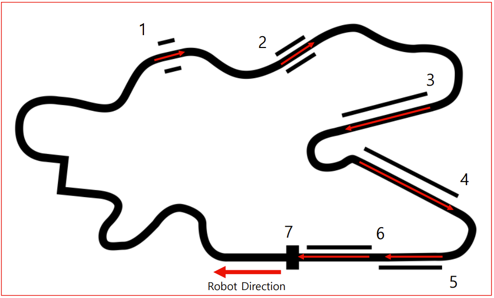

- There are a total of 8 goals to complete.
    - Evaluation for each goal.
- 1 lap

**About Starting Line**

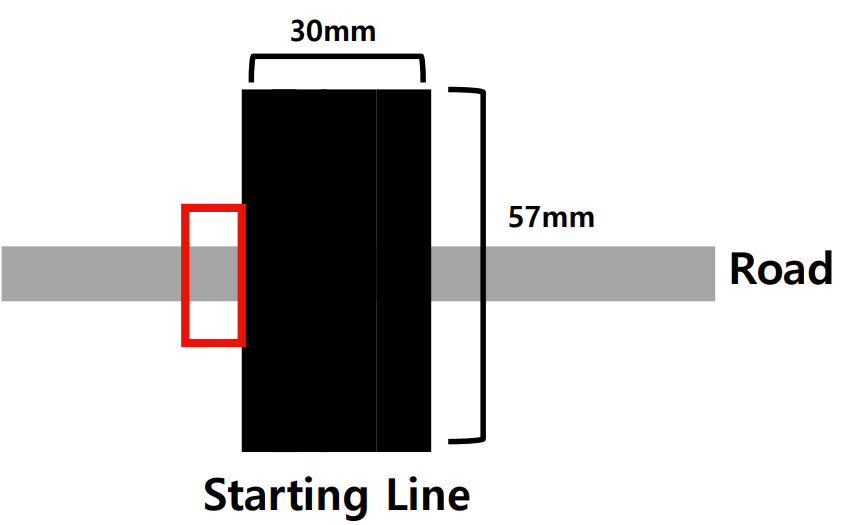
It's okay to start in the red box position for testing.

## First goal – Stop And Start

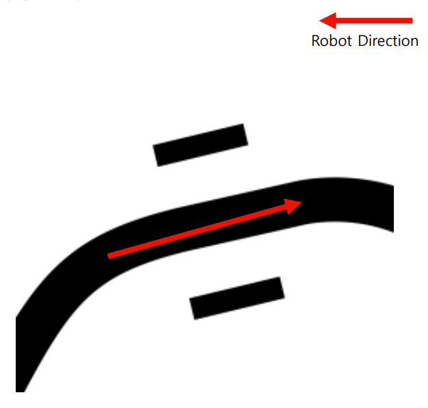
- Pause for a period of time (
    seconds) before starting.
- When that section is reached, the
    robot should start after a 3
    second pause.
- It only needs to work once (on
    first arrival).
- Not exactly 3 seconds, but at
    least as long as the robot shows
    movement after waiting.
       2

## Second Goal - Repeat

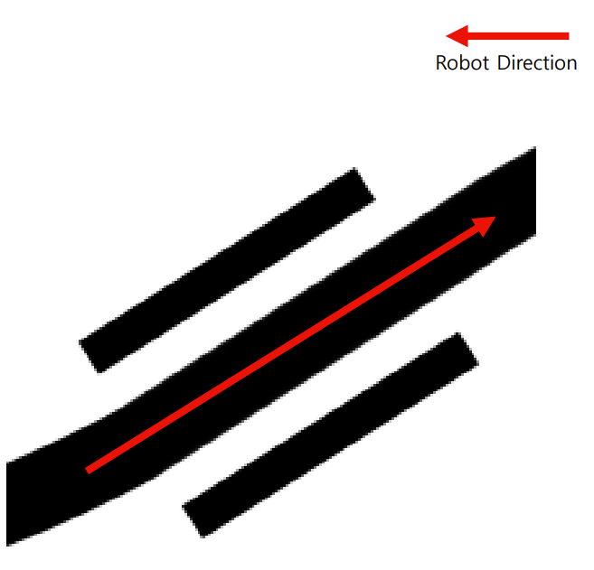
- After two or three repetitions of going back
    and forth without leaving the section, it
    starts.
- When the robot reaches the section, it must
    first move forward along the lines on either
    side, then detect the end of the section and
    move backward again.
- Repeat this two to three times before
    starting.
- Note that the forward and backward
    movements are one set, so when the robot
    leaves this section, it must move backward
    before leaving.
- You don't have to follow the lines on either
    side exactly, just move back and forth within
    the area.

## Third Goal - Deceleration

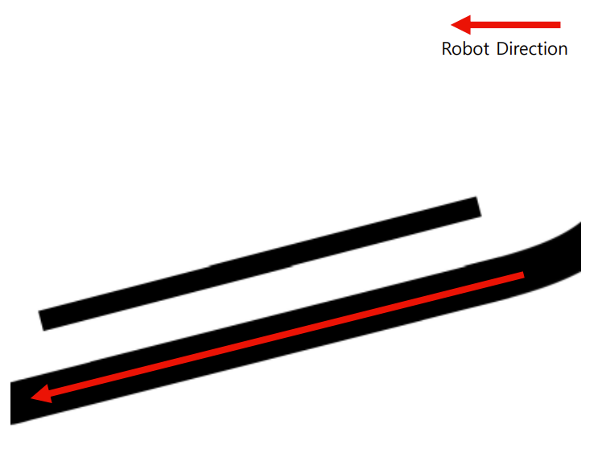
- Upon entering this section,
    the robot must slowly
    decrease its speed to travel
    at a constant speed.
- Of course, at the end of the
    section, it should return to
    its normal speed.

## Fourth Goal - Acceleration

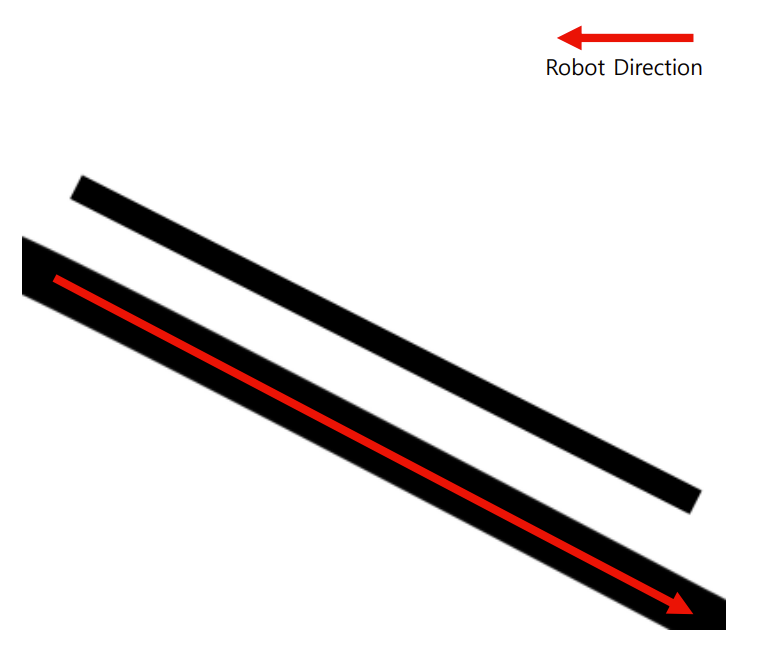
- Upon entering this section,
    the robot must gradually
    accelerate its speed to travel
    at a certain speed.
- As with the previous section,
    it should return to its normal
    speed at the end of the
    section.

## Fifth Goal – Rotate and forward

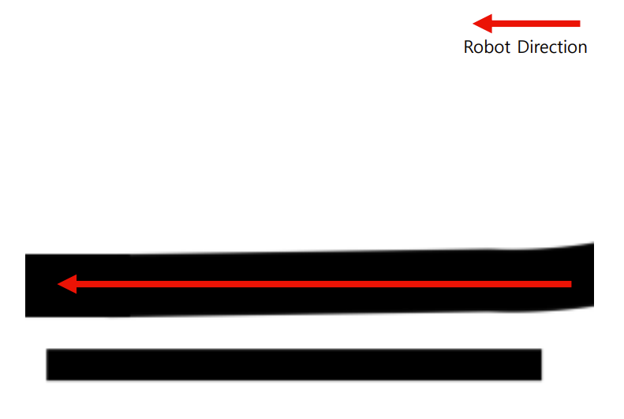
- Upon entering this section,
    the robot must turn left,
    advance slightly, turn right,
    turn left, and exit the section.
- This means that after
    performing all the actions,
    you can proceed to the next
    section along the line.

## Sixth Goal - Rounds

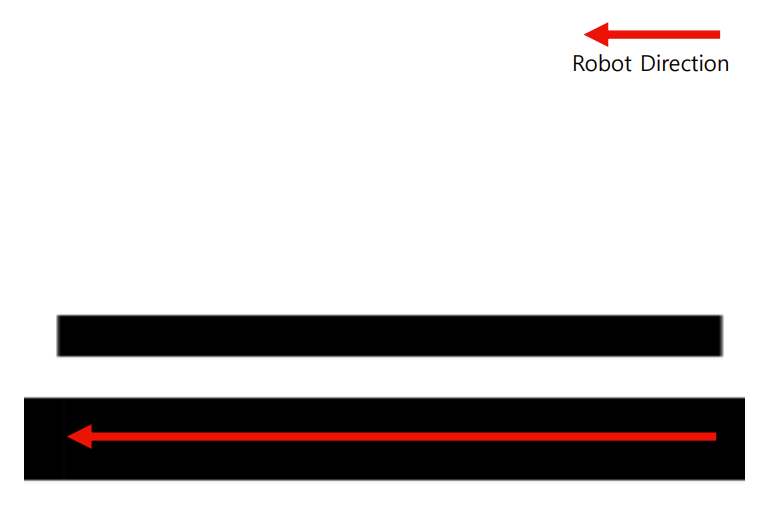
- When entering this section,
    the robot must turn around
    and move to the beginning
    of this section when it
    reaches the end of this
    section.
- When it reaches the
    beginning of this section, it
    must turn around and exit
    this section.

## Seventh goal - Stop or slow down

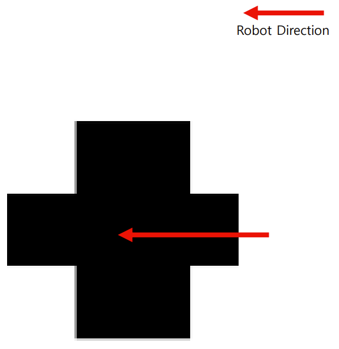
- In this section, the robot
    must stop.
- Or it must pass through this
    section and bring its velocity
    to zero before entering the
    next corner.

## Eighth Goal - Finish

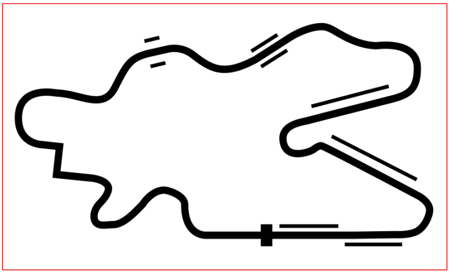
- Determines if you have
    finished.
- In this case, we check to see
    if the robot completed
    normally along the track,
    whether it performed the
    behavior or not.

 
 

**Evaluation**   
Points per section Score  

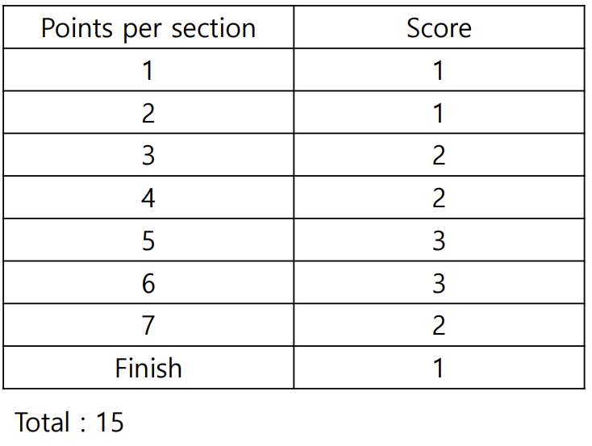  

-Implementing only a portion of the
track does not mean that only that
portion will be tested.

-The robot must travel on the track from
the starting point and reach the
destination.
